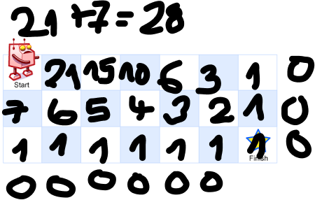

## 62 Unique Path
- https://leetcode.com/problems/unique-paths/
- https://www.youtube.com/watch?v=IlEsdxuD4lY 
- solve using dynamic programming 
- goal can be reached from every position 
- when using DFS, we will hit one position several time. We do not want to solve the same problem several times, so we can have cache[row][column] to save the results 
  - for each position calculate number of ways that we can reach the position 
  - total result is the sum of ways if we go down and right (that are again, sum of ways if choosing to go down and right, that are again... recursion)

